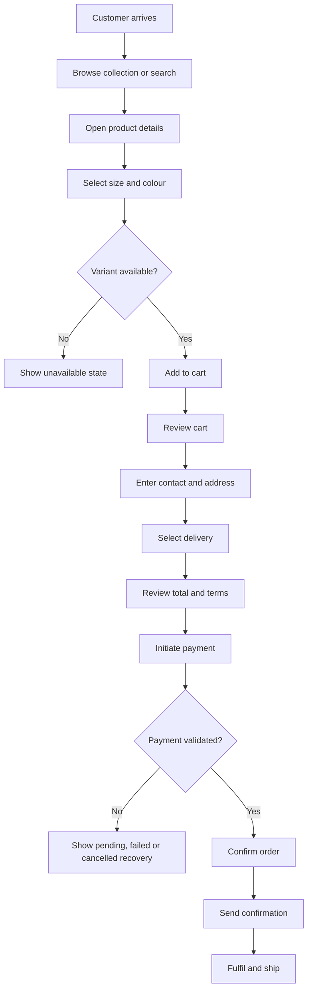

# Guest Purchase Journey Diagram

```mermaid
flowchart TD
    A[Customer arrives] --> B[Browse collection or search]
    B --> C[Open product details]
    C --> D[Select size and colour]
    D --> E{Variant available?}
    E -- No --> F[Show unavailable state]
    E -- Yes --> G[Add to cart]
    G --> H[Review cart]
    H --> I[Enter contact and address]
    I --> J[Select delivery]
    J --> K[Review total and terms]
    K --> L[Initiate payment]
    L --> M{Payment validated?}
    M -- No --> N[Show pending, failed or cancelled recovery]
    M -- Yes --> O[Confirm order]
    O --> P[Send confirmation]
    P --> Q[Fulfil and ship]
```
