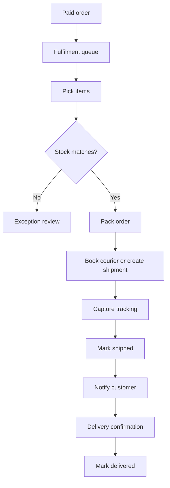

# Order Fulfilment Journey Diagram

```mermaid
flowchart TD
    A[Paid order] --> B[Fulfilment queue]
    B --> C[Pick items]
    C --> D{Stock matches?}
    D -- No --> E[Exception review]
    D -- Yes --> F[Pack order]
    F --> G[Book courier or create shipment]
    G --> H[Capture tracking]
    H --> I[Mark shipped]
    I --> J[Notify customer]
    J --> K[Delivery confirmation]
    K --> L[Mark delivered]
```
