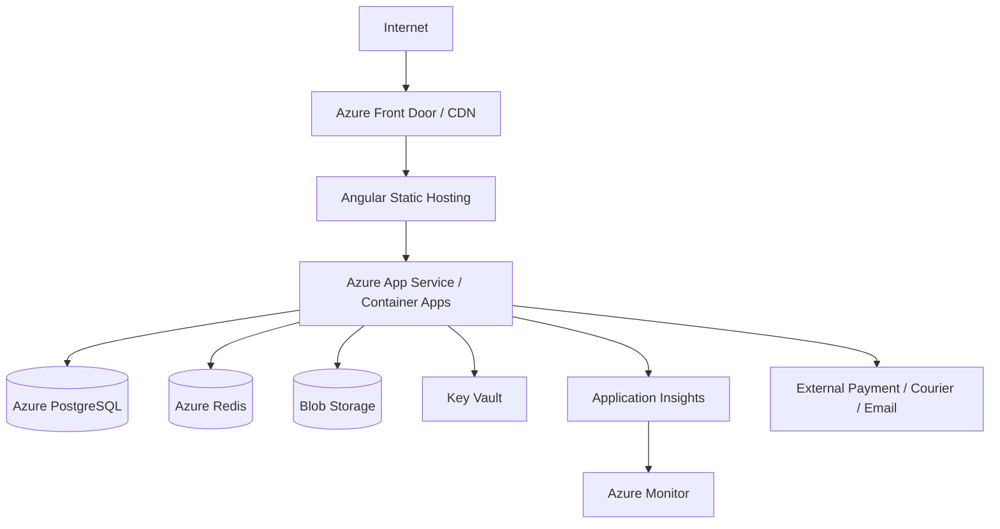

# Azure Deployment Diagram

```mermaid
flowchart TD
    Internet[Internet]
    FD[Azure Front Door / CDN]
    Web[Angular Static Hosting]
    API[Azure App Service / Container Apps]
    PG[(Azure PostgreSQL)]
    Redis[(Azure Redis)]
    Blob[(Blob Storage)]
    KV[Key Vault]
    AI[Application Insights]
    Mon[Azure Monitor]
    Ext[External Payment / Courier / Email]

    Internet --> FD
    FD --> Web
    Web --> API
    API --> PG
    API --> Redis
    API --> Blob
    API --> KV
    API --> AI
    AI --> Mon
    API --> Ext
```
