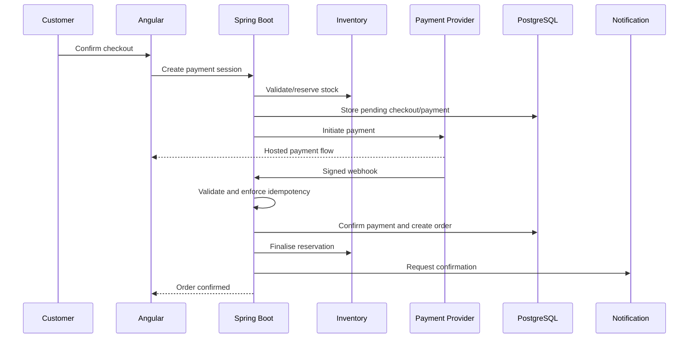

# Payment and Order Confirmation Sequence

```mermaid
sequenceDiagram
    participant C as Customer
    participant UI as Angular
    participant API as Spring Boot
    participant INV as Inventory
    participant PAY as Payment Provider
    participant DB as PostgreSQL
    participant N as Notification

    C->>UI: Confirm checkout
    UI->>API: Create payment session
    API->>INV: Validate/reserve stock
    API->>DB: Store pending checkout/payment
    API->>PAY: Initiate payment
    PAY-->>UI: Hosted payment flow
    PAY->>API: Signed webhook
    API->>API: Validate and enforce idempotency
    API->>DB: Confirm payment and create order
    API->>INV: Finalise reservation
    API->>N: Request confirmation
    API-->>UI: Order confirmed
```
