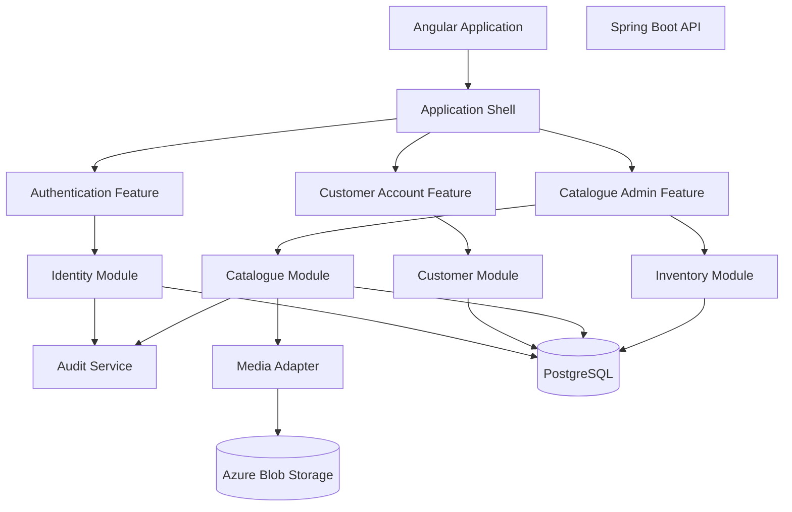

# Phase 1 Component View

```mermaid
flowchart TD
    UI[Angular Application]
    AuthUI[Authentication Feature]
    AccountUI[Customer Account Feature]
    AdminUI[Catalogue Admin Feature]
    Shell[Application Shell]

    API[Spring Boot API]
    Identity[Identity Module]
    Customer[Customer Module]
    Catalogue[Catalogue Module]
    Inventory[Inventory Module]
    Audit[Audit Service]
    Media[Media Adapter]

    DB[(PostgreSQL)]
    Blob[(Azure Blob Storage)]

    UI --> Shell
    Shell --> AuthUI
    Shell --> AccountUI
    Shell --> AdminUI
    AuthUI --> Identity
    AccountUI --> Customer
    AdminUI --> Catalogue
    AdminUI --> Inventory
    Identity --> DB
    Customer --> DB
    Catalogue --> DB
    Inventory --> DB
    Catalogue --> Media
    Media --> Blob
    Identity --> Audit
    Catalogue --> Audit
```
