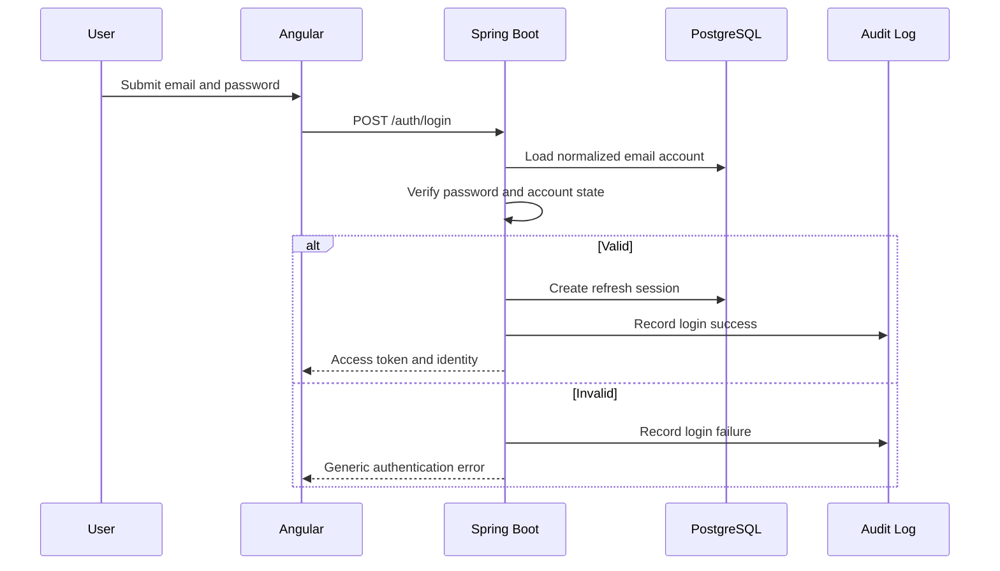

# Login Sequence

```mermaid
sequenceDiagram
    participant U as User
    participant UI as Angular
    participant API as Spring Boot
    participant DB as PostgreSQL
    participant AUD as Audit Log

    U->>UI: Submit email and password
    UI->>API: POST /auth/login
    API->>DB: Load normalized email account
    API->>API: Verify password and account state
    alt Valid
        API->>DB: Create refresh session
        API->>AUD: Record login success
        API-->>UI: Access token and identity
    else Invalid
        API->>AUD: Record login failure
        API-->>UI: Generic authentication error
    end
```
