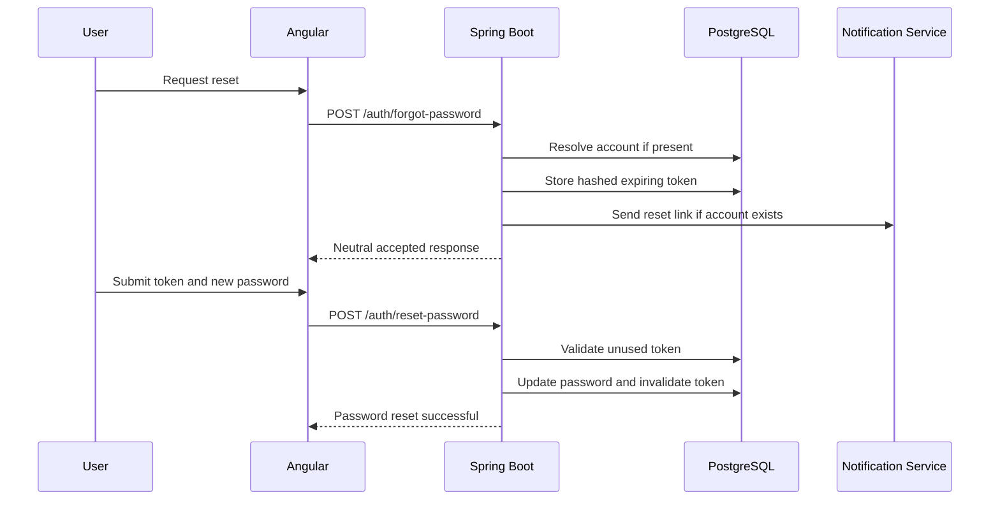

# Password Reset Sequence

```mermaid
sequenceDiagram
    participant U as User
    participant UI as Angular
    participant API as Spring Boot
    participant DB as PostgreSQL
    participant N as Notification Service

    U->>UI: Request reset
    UI->>API: POST /auth/forgot-password
    API->>DB: Resolve account if present
    API->>DB: Store hashed expiring token
    API->>N: Send reset link if account exists
    API-->>UI: Neutral accepted response
    U->>UI: Submit token and new password
    UI->>API: POST /auth/reset-password
    API->>DB: Validate unused token
    API->>DB: Update password and invalidate token
    API-->>UI: Password reset successful
```
